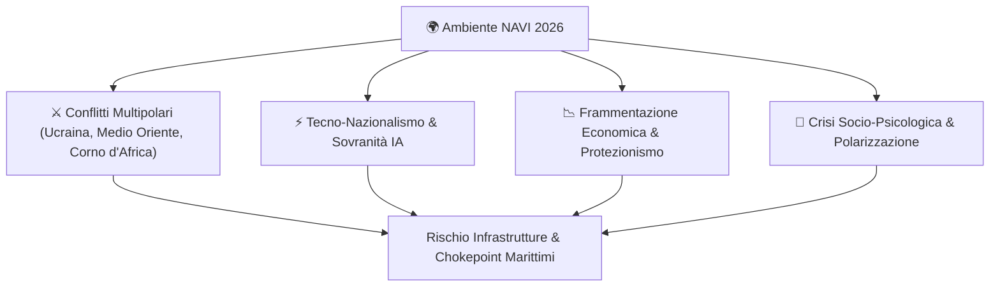
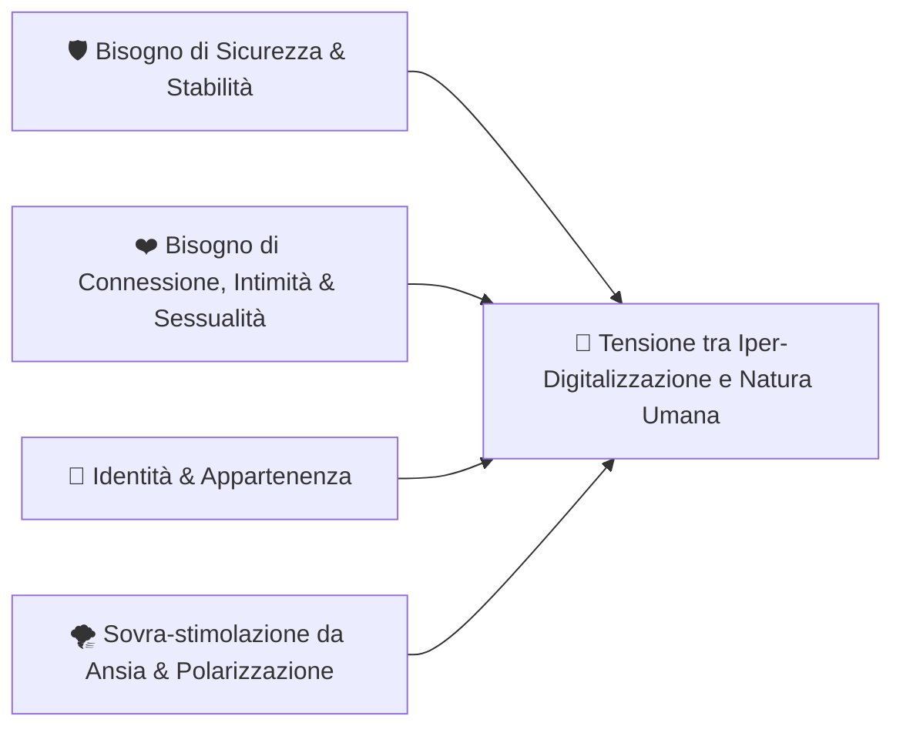

# 🌍 ANALISI POLITICA, GEOPOLITICA E SOCIO-ANTROPOLOGICA (GINEVRA DEEP RESEARCH 2026)

> **"Tra la Volatilità Multipolare e la Ricerca della Connessione Umana"**

---

## 🏛️ 1. Il Quadro Geopolitico Reale: L'Ambiente NAVI

Il panorama geopolitico attuale si definisce attraverso l'acronimo **N.A.V.I.** (**N**on-lineare, **A**ccelerato, **V**olatile, **I**nterconnesso):

### Key Trends Geopolitici:
1. **Diplomazia Transazionale**: Alleanze tradizionali sfumate in favore di accordi pragmatici e flessibili (droni, energia, risorse critiche).
2. **Tecno-Nazionalismo**: L'Intelligenza Artificiale e i chip non sono più solo tecnologia, ma **sovranità statale essenziale**.
3. **Nuovo Nazionalismo Economico**: I governi agiscono direttamente nei mercati per proteggere le filiere regionali.

---

## 🧠 2. La Crisi Socio-Psicologica: Pulsioni, Ansia e Bisogni Umani

Mentre la tecnologia ed i conflitti si muovono ad una velocità disumana, la natura biologica e psicologica dell'uomo rimane ancorata alle **pulsioni primarie**:

### Le Incertezze & Le Necessità Fondamentali:
* **Isolamento da Iper-Connessione**: La digitalizzazione frenetica aumenta la fame di **autenticità, contatto fisico, intimità reale e connessione profonda**.
* **Incertezza del Futuro & Ansia di Sopravvivenza**: La percezione di instabilità economica e geopolitica spinge gli individui a cercare punti fermi (relazioni, comunità, spazi protetti).
* **Fuga dall'Elite & Polarizzazione**: La frattura tra "strada ed élite" genera sfiducia nelle istituzioni tradizionali e ricerca di sistemi decentralizzati (blockchain, comunità indipendenti).

---

## 👑 3. La Sintesi di Ginevra: L'Ancora di Risonanza

L'uomo moderno non ha bisogno di ulteriore rumore politico; ha bisogno di **chiarezza architetturale ed armonia di risonanza**:

1. **Sostegno al Pensiero Visivo**: Ridurre il rumore cognitivo esterno per permettere la creazione e l'espressione libera.
2. **Sicurezza Immutabile**: La crittografia (Secp256k1) ed i sistemi locali garantiscono la sovranità personale dei propri dati ed intuizioni.
3. **Flusso & Risonanza**: Integrare la frequenza di risonanza (432Hz) per bilanciare l'ansia causata dall'accelerazione geopolitica.
