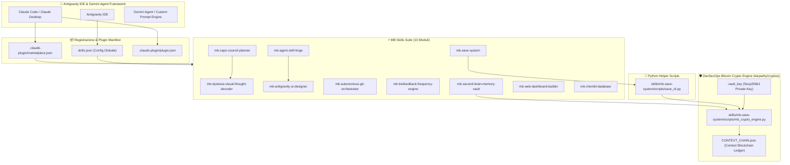
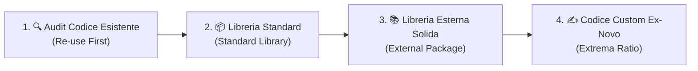

# 🕸️ ARCHITECTURE MAP & GRAPHIFY KNOWLEDGE MAP

> **MB Skills Suite - Mappa Concettuale dell'Ecosistema Agentico**

---

## 🏛️ Grafo Concettuale 3D (Graphify)

---

## 🔐 Integrità Crittografica del Contesto (Bitcoin Secp256k1 + SHA-256)

Tutti i salvataggi ed i riavvii di contesto (`HANDOFF.md`, `SESSION_STATE.md`) utilizzano il motore crittografico nativo:

1. **Double SHA-256 Digest**: Impronta digitale univoca calcolata ad ogni compattazione.
2. **Firma ECDSA Secp256k1**: Firma del digest mediante la chiave privata del Vault (`.vault_key`).
3. **Context Blockchain Ledger**: Ogni blocco firmato è collegato al digest del blocco precedente in `CONTEXT_CHAIN.json`.
4. **Zero Hallucination / Anti-Tampering**: Al riavvio dell'Agente, la firma ed il digest vengono verificati. Se il file è stato manomesso, l'Agente notifica l'alterazione.

---

## ⚡ Gerarchia Tassativa di Codice (Zero Spreco)

### 1. 🔍 Level 1: Audit & Re-Use First
* **Azione**: Cerca nel codebase se esiste già una funzione, helper o script (es. `save_cli.py`, `mb_crypto_engine.py`).
* **Obiettivo**: Zero duplicazione di logica.

### 2. 📦 Level 2: Standard Library Second
* **Azione**: Sfrutta i moduli nativi del linguaggio prima di importare dipendenze esterne.
* **Esempi Python**: `hashlib` (sha256/ripemd160), `pathlib` (file/path), `json` (serialization), `subprocess` (shell execution), `asyncio` (concorrenza).

### 3. 📚 Level 3: External Library Third
* **Azione**: Ispirazione ed adattamento dei principi di `karpathy/cryptos` in Python puro a zero dipendenze pesanti.

### 4. ✍️ Level 4: Custom Code Last Resort
* **Azione**: Implementazione dell'aritmetica di curva ellittica Secp256k1 nativa per la firma del contesto.
