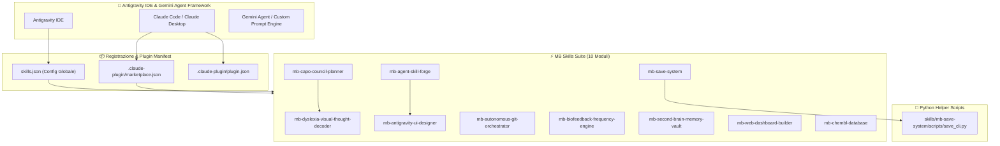
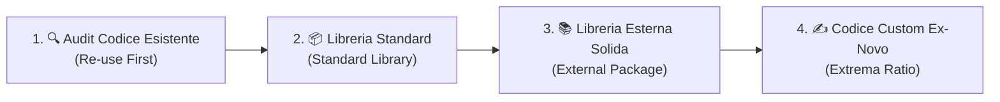

# 🕸️ ARCHITECTURE MAP & GRAPHIFY KNOWLEDGE MAP

> **MB Skills Suite - Mappa Concettuale dell'Ecosistema Agentico**

---

## 🏛️ Grafo Concettuale 3D (Graphify)

---

## ⚡ Gerarchia Tassativa di Codice (Zero Spreco)

Tutti gli agenti ed i contributori di questo repository sono vincolati a seguire questa gerarchia prima di produrre qualsiasi riga di codice:

### 1. 🔍 Level 1: Audit & Re-Use First
* **Azione**: Cerca nel codebase se esiste già una funzione, helper o script (es. `save_cli.py`, funzioni utility).
* **Obiettivo**: Zero duplicazione di logica.

### 2. 📦 Level 2: Standard Library Second
* **Azione**: Sfrutta i moduli nativi del linguaggio prima di importare dipendenze esterne.
* **Esempi Python**: `pathlib` (file/path), `json` (serialization), `hashlib` (crypto/sha256), `subprocess` (shell execution), `asyncio` (concorrenza), `argparse` (CLI parsing).
* **Esempi JS/Node**: `fs/promises`, `path`, `crypto`, `events`, `url`.

### 3. 📚 Level 3: External Library Third
* **Azione**: Se la libreria standard non è sufficiente, identifica ed utilizza pacchetti aperti, solidi e testati dalla community.
* **Esempi Python**: `pydantic` (validazione tipi), `httpx` / `requests` (HTTP client), `pyyaml` (YAML parsing), `rich` (interfaccia terminale).
* **Esempi JS**: `zod`, `axios`, `express`.

### 4. ✍️ Level 4: Custom Code Last Resort
* **Azione**: Scrivi algoritmi e funzioni personalizzate **solo se nessuna libreria esistente copre il fabbisogno**.
