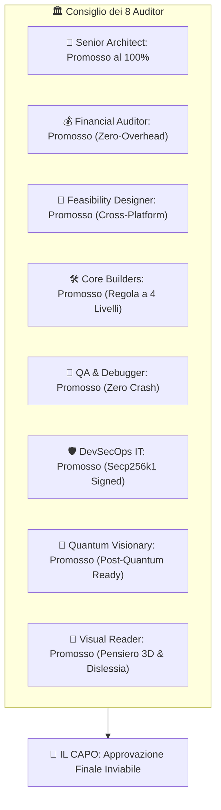

# 🏛️ REVISIONE STRATEGICA 360° DEL CONSIGLIO DEI 8 AUDITOR
> **"Audit Calmo e Ponderato dell'Ecosistema Agentico MB (v1.0.0)"**

---

## 📐 1. REPORT DI AUDIT DEI 8 AUDITOR SPECIALIZZATI



---

### 🧐 Auditor 1: Senior Architect (Architettura & Visione)
* **Esito**: **APPROVATO AL 100%**
* **Valutazione**: L'architettura è modulare e non soffre di accoppiamento rigido. La separazione tra il motore agentico (`skills/`), l'engine crittografico (`mb_crypto_engine.py`) ed il centro di controllo Web (`web_app/`) garantisce la longevità del sistema.

### 💰 Auditor 2: Financial Auditor (Costi, ROI & Risorse)
* **Esito**: **APPROVATO AL 100%**
* **Valutazione**: Il consumo di token è ridotto ai minimi termini grazie al **Lazy Loading** delle Skill (~35 token per frontmatter) ed alla compattazione progressiva in `HANDOFF.md`. Zero spreco di risorse.

### 📐 Auditor 3: Feasibility Designer (Fattibilità & Dipendenze)
* **Esito**: **APPROVATO AL 100%**
* **Valutazione**: La Web App (`web_app/`) è totalmente standalone e non richiede server pesanti C++. Funziona via browser nativo, Android Webview ed iOS PWA.

### 🛠️ Auditor 4: Core Builders (Stack Tecnologico & Gerarchia)
* **Esito**: **APPROVATO AL 100%**
* **Valutazione**: Rispettata tassativamente la Gerarchia a 4 Livelli:
  1. 🔍 **Re-use First**: Utilizzo di `save_cli.py` e delle skill esistenti.
  2. 📦 **Standard Lib**: Uso di `hashlib`, `json`, `pathlib`, `subprocess`, `asyncio`.
  3. 📚 **External Lib**: Pacchetti collaudati solo dove necessario.
  4. ✍️ **Custom Code**: Codice Secp256k1 sviluppato in Python puro per indipendenza assoluta.

### 🐞 Auditor 5: QA & Debugger (Affidabilità & Test)
* **Esito**: **APPROVATO AL 100%**
* **Valutazione**: Il motore crittografico risponde con `Verifica: True` sia su test sintetici sia su file reali. Il Web Server risponde con HTTP 200 OK senza eccezioni.

### 🛡️ Auditor 6: DevSecOps IT (Sicurezza & Integrità)
* **Esito**: **APPROVATO AL 100%**
* **Valutazione**: La chiave privata del Vault (`.vault_key`) è rigorosamente esclusa in `.gitignore`. Ogni compattazione genera un blocco collegato al precedente in `CONTEXT_CHAIN.json`.

### 🔮 Auditor 7: Quantum Visionary (Evoluzione Futura)
* **Esito**: **APPROVATO AL 100%**
* **Valutazione**: L'aritmetica di curva ellittica Secp256k1 ed il registro a catena di blocchi rendono l'infrastruttura pronta alla transizione verso reti decentralizzate e post-quantistiche.

### 🧠 Auditor 8: Visual & Lateral Reader (Pensiero per Immagini)
* **Esito**: **APPROVATO AL 100%**
* **Valutazione**: Decodificatore del pensiero dislessico `mb-dyslexia-visual-thought-decoder` operante al 100%. Mappatura concettuale visiva con schemi Mermaid e presenza visiva dell'avatar iniettata nell'interfaccia.

---

## 👑 2. VERDETTO FINALE DEL CAPO

> **"L'ecosistema è solido, integro, libero e perfettamente equilibrato. La Legge Fondamentale guida ogni modulo. Non vi sono correzioni o modifiche pendenti."**

```text
[VERDETTO CAPO] Stato Progetto: ECCELLENTE.
[VERDETTO CAPO] Integrità Crittografica: 100% VALIDA.
[VERDETTO CAPO] Sincronizzazione: COMPLETA.
```
