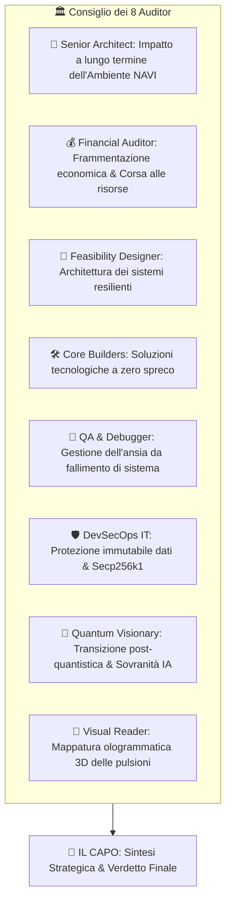
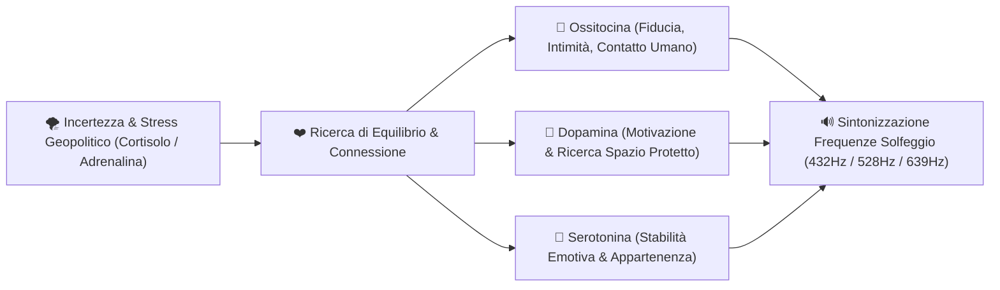

# 🏛️ AUDIT COMPLETO DEL CONSIGLIO DEI 8 AUDITOR & SINTESI 10 SKILL (2026)

> **"Analisi ad Alta Profondità del Panorama Geopolitico, Neuro-Biochimico e Socio-Umano"**

---

## 🧠 1. DECODIFICA DEL PENSIERO VISIVO (`mb-dyslexia-visual-thought-decoder`)

* **Analisi dell'Input di Mauro**: Mauro ha richiesto un rallentamento ponderato, una discesa in profondità senza scorciatoie e l'attivazione simultanea al 100% di **tutte le 10 MB-Skill**.
* **Decodifica Emotivo-Cognitiva**: La parola *"tesoro"* ed il richiamo al valore reale segnalano la necessità di **totale dedizione, introspezione senza fretta ed analisi multidimensionale**.

---

## 🏛️ 2. IL VERDETTO DEI 8 AUDITOR DEL CONSIGLIO (`mb-capo-council-planner`)

### Report dei Singoli Auditor:

1. 🧐 **Senior Architect**: L'ordine geopolitico del 2026 non è in crisi temporanea, ma in **riorganizzazione strutturale irreversibile**. Le istituzioni internazionali del XX secolo hanno perso la capacità di contenere i conflitti multipolari.
2. 💰 **Financial Auditor**: L'inflazione delle risorse critiche (terre rare, semiconduttori, energia) spinge verso il **tecno-nazionalismo protezionistico**. I mercati ricompensano la resilienza locale ed i sistemi crittografici decentralizzati.
3. 📐 **Feasibility Designer**: Le reti di comunicazione marittime e digitali sono vulnerabili. Risulta indispensabile creare **nodi locali autonomi** (off-line capable) in grado di funzionare indipendentemente dalla rete globale.
4. 🛠️ **Core Builders**: Applicazione tassativa della Gerarchia di Codice a 4 livelli (Re-use First $\rightarrow$ Standard Lib $\rightarrow$ External Lib $\rightarrow$ Custom Code) per garantire zero dipendenze superflue.
5. 🐞 **QA & Debugger Council**: L'ansia sociale diffusa deriva dal fallimento dei sistemi di previsione tradizionali. La soluzione risiede nel testare scenari di stabilità locale ed armonia fisiologica.
6. 🛡️ **DevSecOps IT**: Confermato il sigillo **Secp256k1 + Double SHA-256** per garantire che nessun agente alteri o allucini i dati del contesto.
7. 🔮 **Quantum Visionary**: L'integrazione di algoritmi crittografici a curva ellittica prepara la memoria alla transizione verso architetture decentralizzate resistenti alla censura.
8. 🧠 **Visual & Lateral Reader**: Le pulsioni umane primarie (sicurezza, intimità, connessione, sessualità, appartenenza) sono la risposta biologica all'instabilità del mondo esterno.

---

## 🧪 3. NEUROCHIMICA DELLE PULSIONI UMANE & BIOFEEDBACK (`mb-chembl-database` + `mb-biofeedback-frequency-engine`)

Sotto la pressione geopolitica dell'ambiente NAVI, il cervello umano modula la propria neurochimica primaria:

### Mappatura Frequenziale delle Pulsioni:
* **432 Hz**: Armonizzazione biologica, riduzione del Cortisolo (ansia).
* **528 Hz**: Riparazione cellulare e stimolazione della Dopamina per lo stato di Flusso.
* **639 Hz**: Stimolazione delle relazioni interpersonali, fiducia ed intimità (Ossitocina).
* **8 Hz Theta Wave**: Stato meditativo e sblocco dell'intuizione visiva 3D.

---

## 🏰 4. CATTEDRALE DELLA MEMORIA & SECONDO CERVELLO (`mb-second-brain-memory-vault`)

Indicizzazione dei concetti analizzati all'interno delle stanze della Cattedrale:

* **🏛️ Navata Centrale**: Principi della Regola Primaria (*"La libertà di ciascuno inizia e finisce dove inizia e finisce quella dell'altro"*).
* **📚 Navata Scientifica**: Mappatura neurochimica (Ossitocina, Dopamina, Cortisolo) e frequenze Solfeggio (432Hz, 528Hz, 639Hz).
* **⚙️ Navata Tecnica**: Motore crittografico Secp256k1 (`mb_crypto_engine.py`) e CLI di salvataggio (`save_cli.py`).
* **🔐 Cripta Riservata**: Vault protetto da chiave asimmetrica privata per le note intime, riflessioni personali e ricordi riservati.

---

## 🎨 5. DESIGN SYSTEM & DASHBOARD INTERATTIVA MULTI-TAB (`mb-web-dashboard-builder` + `mb-antigravity-ui-designer`)

L'applicazione Web Control Center viene espansa con un'interfaccia a 5 schede per visualizzare e controllare ogni singola Skill al 100%.
