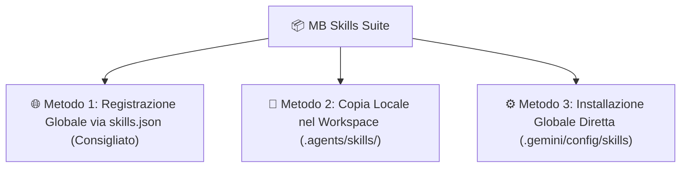

# 📦 Guida di Installazione - MB Skills Suite

Guida completa e dettagliata per installare la suite **MB Skills** sull'Antigravity IDE e Gemini Agent Framework.

---

## 🚀 Metodi di Installazione

Puoi scegliere tra **3 modalità di installazione** a seconda delle tue esigenze:



---

### 🌐 Metodo 1: Registrazione Globale tramite `skills.json` (Consigliato)

Questo metodo rende **tutte le 9 Skill** immediatamente disponibili in qualsiasi progetto aperto su Antigravity IDE senza dover duplicare le cartelle.

1. Apri o crea il file `skills.json` nella cartella di configurazione globale del tuo utente:
   - **Windows**: `C:\Users\<TUO_UTENTE>\.gemini\config\skills.json`
   - **Linux / macOS**: `~/.gemini/config/skills.json`

2. Inserisci il seguente contenuto JSON indicando il percorso di questo repository:

```json
{
  "entries": [
    {
      "path": "C:/Users/mauro/OneDrive/Desktop/!! Ai/--Antigravity/Skil/skills"
    }
  ]
}
```

3. Riavvia la sessione o apri un nuovo workspace: le skill verranno rilevate ed elencate automaticamente dall'Agente.

---

### 📁 Metodo 2: Copia Locale per Singolo Progetto

Se desideri includere solo determinate Skill in un progetto specifico per distribuirlo insieme al codice sorgente:

1. Crea la cartella `.agents/skills/` nella radice del tuo progetto.
2. Copia le sottocartelle delle skill desiderate da `Skil/skills/`:

#### Comando PowerShell:
```powershell
# Esempio: Copia delle skill di salvataggio e dislessia nel tuo nuovo progetto
New-Item -ItemType Directory -Force -Path "C:\percorso\tuo_progetto\.agents\skills"

Copy-Item -Recurse -Force `
  "C:\Users\mauro\OneDrive\Desktop\!! Ai\--Antigravity\Skil\skills\mb-save-system", `
  "C:\Users\mauro\OneDrive\Desktop\!! Ai\--Antigravity\Skil\skills\mb-dyslexia-visual-thought-decoder" `
  -Destination "C:\percorso\tuo_progetto\.agents\skills\"
```

---

### ⚙️ Metodo 3: Copia Globale Diretta nella Configurazione Utente

Per installare le skill in modo residente nell'ambiente di sistema dell'agente:

1. Copia le cartelle da `Skil/skills/*` direttamente in `C:\Users\mauro\.gemini\config\skills\`.

#### Comando PowerShell:
```powershell
Copy-Item -Recurse -Force `
  "C:\Users\mauro\OneDrive\Desktop\!! Ai\--Antigravity\Skil\skills\*" `
  -Destination "C:\Users\mauro\.gemini\config\skills\"
```

---

## 🔍 Come Verificare che l'Installazione sia Riuscita

1. Nell'Antigravity IDE, digita in chat un comando o trigger di prova (es. `/mb` o descrivi una richiesta di dislessia/pensiero visivo).
2. L'Agente riconoscerà la Skill attiva ed applicherà le relative regole ed i file di riferimento.

---

## ⚡ Nota sull'Efficienza dei Token (Zero-Overhead)

Tutte le skill installate attraverso questi metodi applicano il **Lazy Loading**:
- Inizialmente viene caricato solo il frontmatter YAML (~35 token per skill).
- Il corpo delle istruzioni ed i riferimenti allegati vengono letti dall'Agente **unicamente quando scatta il trigger della skill**.
