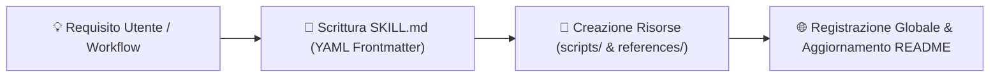

# ⚒️ Skill: `mb-agent-skill-forge`
> **Fucina e Validazione delle Skill per Agenti AI**

Questa meta-skill abilita l'Agente a **progettare, costruire, validare e documentare in autonomia nuove Skill** ad altissimo livello di integrazione per l'Antigravity IDE e l'ecosistema dell'utente.

---

## 📐 Anatomia Ufficiale di una Skill

Ogni skill deve essere posizionata in `skills/<skill-name>/` e contenere:

1. **`SKILL.md` (Obbligatorio)**:
   - Frontmatter YAML con `name` e `description` contenenti trigger chiari.
   - Intestazione con Filosofia e Principi.
   - Moduli operativi passo-passo.
   - Checklist di validazione finale.
2. **`references/` (Opzionale)**: Documentazione approfondita, casi di studio, schemi di dati.
3. **`scripts/` (Opzionale)**: Script helper Python/Bash/JS eseguibili.
4. **`resources/` (Opzionale)**: Template statici o dati di supporto.

---

## ⚡ Trigger di Attivazione

Attiva questa skill quando:
- L'utente dice "crea una skill", "forgia una competenza", "aggiungi una skill per X".
- Occorre standardizzare un nuovo workflow ricorrente.

---

## 🛠️ Procedura di Forgiatura in 4 Passaggi

1. **Creazione Cartella**: `skills/mb-<nome-skill>/`
2. **Generazione `SKILL.md`**: Con YAML frontmatter rigoroso.
3. **Deploy Globale**: Copia in `C:\Users\mauro\.gemini\config\skills\mb-<nome-skill>\` se richiesto dall'utente.
4. **Aggiornamento Documentazione**: Aggiungi alla tabella di `README.md`, aggiorna `SESSION_STATE.md` e `HANDOFF.md`.
