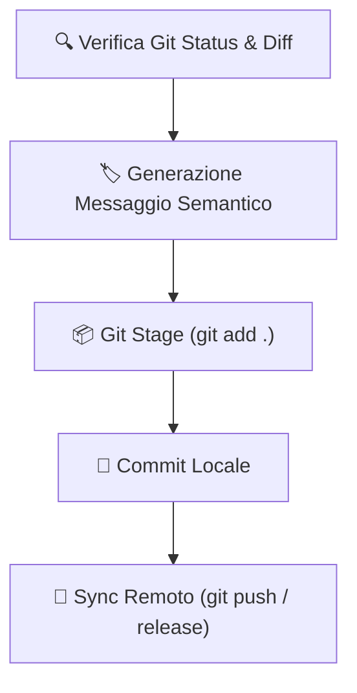

# 🌿 Skill: `mb-autonomous-git-orchestrator`
> **Orchestrazione Avanzata di Git, Release & Workflow Multibranch**

Questa skill fornisce all'Agente le capacità per **gestire in completa autonomia il controllo versione Git** del repository, applicando convenzioni di **Commit Semantici**, creando tag di release, risolvendo conflitti e sincronizzando i rami remoti (GitHub).

---

## 📌 Standard dei Commit Semantici (Conventional Commits)

L'Agente formatta sempre i commit secondo lo standard:
- `feat(skill)`: Nuova funzionalità o nuova skill aggiunta.
- `fix(core)`: Correzione di bachi o problemi di esecuzione.
- `docs(readme)`: Aggiornamenti alla documentazione.
- `style(ui)`: Modifiche estetiche senza impatto logico.
- `refactor(code)`: Ristrutturazione di codice esistente.

---

## ⚡ Trigger di Attivazione

Attiva questa skill quando:
- Si eseguono salvataggi di versione, rilascio di tag o sincronizzazione con GitHub.
- L'utente richiede di gestire rami Git, pulire la storia dei commit o creare una release.
- Si completa una serie di task e occorre sincronizzare il repository remoto.

---

## 🛠️ Flusso Operativo di Orchestrazione

