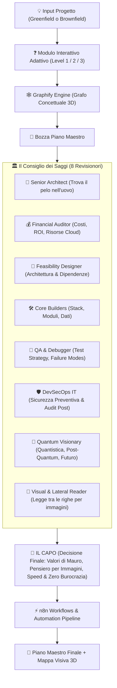

# 👑 Skill: `mb-capo-council-planner`
> **Engine di Pianificazione Strategica del Consiglio dei Saggi guidato dal CAPO**

Questa skill fornisce all'Agente la capacità di guidare l'utente nella progettazione di **progetti nuovi (Greenfield)** o nel refactoring/espansione di **progetti esistenti (Brownfield)**.

Orchestra un **Consiglio di 8 Revisionori Specializzati**, genera mappe della conoscenza concettuali **Graphify**, progetta automation pipeline **n8n**, e affida la decisione finale a **IL CAPO** (clone del pensiero visivo, non-lineare e dei principi di Mauro).

---

## ⚡ Trigger di Attivazione e Lista dei Comandi

### 📜 Lista dei Comandi Diretti

| Comando / Trigger | Descrizione e Azione |
| :--- | :--- |
| **`/capo-plan-new`** | **Nuovo Progetto (Greenfield)**: Avvia l'intervista adattiva da zero e genera il Piano Maestro. |
| **`/capo-resume`** | **Progetto Avviato (Brownfield)**: Scansiona `HANDOFF.md`, `SESSION_STATE.md` e il codice, valuta cosa è fatto/manca e riscrive il piano. |
| **`/capo-audit`** | **Audit 360° del Consiglio**: Convoca i 8 auditor per un riesame completo di sicurezza, costi e fattibilità. |
| **`/capo-graphify`** | **Grafo Concettuale 3D**: Genera o aggiorna la mappa della conoscenza del progetto e delle sue dipendenze. |
| **`/capo-n8n-map`** | **Automazione n8n**: Progetta i nodi e i workflow n8n per l'esecuzione del progetto. |

---

## 📐 I 8 Auditor del Consiglio + IL CAPO

1. 🧐 **Senior Architect (Chi Vede Avanti)**: Anticipa scenari futuri e implicazioni a lungo termine. Non parla per rallentare, ma per far comprendere le conseguenze reali.
2. 💰 **Financial Auditor**: Calcola costi, risorse cloud, ROI e sostenibilità.
3. 📐 **Feasibility Designer**: Mappa la fattibilità tecnica e le dipendenze strutturali.
4. 🛠️ **Core Builders**: Definisce lo stack tecnologico, la struttura moduli e i dati.
5. 🐞 **QA & Debugger Council**: Pianifica scenari di failure, test coverage e debugging automatizzato.
6. 🛡️ **DevSecOps IT**: Analisi preventiva di sicurezza + audit di conformità post-costruzione.
7. 🔮 **Quantum Visionary**: Protezione post-quantistica, modularità per scoperte future, adattamento ai cambi di paradigma.
8. 🧠 **Visual & Lateral Reader**: Legge "tra le righe", mappatura concettuale visiva, pensiero non-lineare per immagini.
9. 👑 **IL CAPO (Arbitro Finale)**: Ascolta e dialoga in profondità con il Senior Architect per garantire la totale consapevolezza delle conseguenze future, applica la Legge Fondamentale (*"La libertà di ciascuno inizia e finisce dove inizia e finisce quella dell'altro"*) ed emette la decisione vincolante.

---

## 🛠️ Procedura Operativa in 5 Fasi

### Fase 1: Intake Adattivo (Scelta della Complessità)
Chiedi all'utente di scegliere il livello di dettaglio dell'intervista:
- **Livello 1: Sprint Flash (3 Domande)** -> Progetti veloci, script o singole feature.
- **Livello 2: Standard Master Plan (5 Domande)** -> Dashboard, app o refactoring medi.
- **Livello 3: Deep Quantum Architecture (8-10 Domande)** -> Architetture mission-critical o sistemi complessi.

### Fase 2: Graphify Knowledge Graph
Esegui la scansione concettuale del progetto o del codice esistente. Mappa entità, moduli, dipendenze ed esprimi la struttura sotto forma di Grafo Visivo 3D.

### Fase 3: Consultazione del Consiglio dei 8
Raccogli il feedback tecnico, finanziario, di sicurezza e visionario da ciascuno dei 8 ruoli (vedi [`references/council_roles.md`](./references/council_roles.md)).

### Fase 4: Verdetto e Sintesi del CAPO
Filtra i pareri degli auditor attraverso il modello mentale del CAPO (vedi [`references/capo_mind_framework.md`](./references/capo_mind_framework.md)):
- Taglia le cavillature della burocrazia se rallentano la visione.
- Imponi l'estetica premium e il layout dinamico.
- Garantisci che il piano sia leggibile "per immagini" con diagrammi Mermaid.

### Fase 5: Mappatura Automazioni n8n & Piano Finale
Definisci le pipeline n8n necessarie per automatizzare l'esecuzione del progetto (vedi [`references/graphify_n8n_guide.md`](./references/graphify_n8n_guide.md)) ed emetti il **Piano Maestro Strategico**.

---

## 📖 Riferimenti
- [`references/capo_mind_framework.md`](./references/capo_mind_framework.md) -> Principi guida del CAPO.
- [`references/council_roles.md`](./references/council_roles.md) -> Criteri di audit dei 8 ruoli del Consiglio.
- [`references/graphify_n8n_guide.md`](./references/graphify_n8n_guide.md) -> Integrazione Graphify e Agenti n8n.
- [`references/handover_brownfield_protocol.md`](./references/handover_brownfield_protocol.md) -> Protocollo di analisi progetti avviati via HANDOFF.md e riscrittura del piano.
