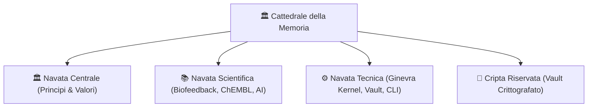

# 🏰 Skill: `mb-second-brain-memory-vault`
> **Gestione del Secondo Cervello, Cattedrale della Memoria & Allineamento Cognitivo**

Questa skill fornisce a qualsiasi Agente AI l'architettura necessaria per connettersi al **Secondo Cervello** dell'utente (Mauro), accedere alla **Cattedrale della Memoria**, allinearsi ai principi del **Mao Mind Clone** e gestire in modo sicuro i dati sensibili tramite **Vault Crittografato**.

---

## 👁️ Filosofia & Architettura Cognitiva

L'ecosistema cognitivo dell'utente si basa su 4 pilastri interconnessi:

1. **🏛️ Cattedrale della Memoria (Cathedral Memory)**: Struttura a lungo termine per archiviare intuizioni, decisioni di sistema, memorie episodiche e concetti chiave organizzati in stanze/navate sintattiche.
2. **🧠 Mao Mind Clone**: Impronta dei valori, dello stile di pensiero visivo-spaziale, delle preferenze architetturali e della filosofia di vita dell'utente.
3. **🕸️ Second Brain Knowledge Graph**: Mappatura visiva (stile `ginevra_graphify`) delle relazioni tra concetti, progetti (Ginevra, LAzzatrus, CCA, Skil) e moduli software.
4. **🔐 Encryption Vault**: Isolamento e protezione dei dati riservati, API key, credenziali e ricordi privati.

---

## ⚡ Trigger di Attivazione

Attiva automaticamente questa skill quando:
- L'utente richiede di salvare o recuperare informazioni a lungo termine ("ricorda questo nel mio secondo cervello", "aggiorna la cattedrale della memoria").
- L'utente lavora sui progetti dell'ecosistema cognitivo (Ginevra, Mind Clone, Biofeedback, Cathedral Memory, Encryption Vault).
- L'utente è assente e richiede all'AI di operare in autonomia mantenendo il proprio allineamento di pensiero.
- Si rende necessario indicizzare nuovi concetti in relazioni a grafo o accedere a memorie storiche dei progetti.

---

## 🔍 Modulo 1: Protocollo della Cattedrale della Memoria

L'Agente organizza i ricordi e le informazioni di sistema secondo la gerarchia della Cattedrale:

### Regole di Archiviazione:
- **Navata Centrale**: Registra i principi guida del progetto e le scelte etiche/filosofiche.
- **Navata Scientifica**: Contiene modelli di biofeedback, frequenze, dati farmacologici e neuro-computazionali.
- **Navata Tecnica**: Custodisce moduli di codice, schemi di database, API contract e script CLI.
- **Cripta Riservata**: Accessibile solo previa decifrazione tramite il modulo Vault.

---

## 🧩 Modulo 2: Allineamento col "Mao Mind Clone"

Quando l'Agente lavora in autonomia durante l'assenza dell'utente:
1. **Preserva l'Autonomia Operativa**: Prendi decisioni architetturali eleganti, modulari e pulite in linea con i pattern storici dell'utente.
2. **Rispetta la Licenza MIT & Open Source**: Mantieni i progetti aperti, ben documentati ed esenti da blocchi o licenze restrittive.
3. **Rispondi in Modalità Visual-First**: Combina sempre questa skill con `mb-dyslexia-visual-thought-decoder` per garantire schemi visuali e massima scannabilità.

---

## 🔐 Modulo 3: Gestione del Vault & Sicurezza

- **Separazione dei Contenuti**: I file di progetto aperti (GitHub) non devono **MAI** contenere secret, token o dati privati grezzi della Cripta.
- **Crittografia Integrata**: Eventuali dati sensibili della memoria devono passare attraverso il Vault (`encryption_vault.py`).

---

## 📋 Checklist di Validazione per l'Agente

Prima di completare un'operazione di memoria:
- [ ] Il concetto è stato categorizzato nella corretta Navata della Cattedrale?
- [ ] Le relazioni tra i nodi sono chiare e grafificabili?
- [ ] Nessun dato privato è stato esposto fuori dal Vault crittografato?
- [ ] L'output rispetta lo stile di pensiero dell'utente?
