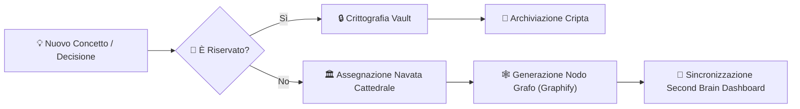

# 🏛️ Guida Architetturale: Cattedrale della Memoria & Second Brain

Questo documento definisce i principi di integrazione tra i vari sottosistemi dell'utente (Mauro) e la struttura della memoria a lungo termine per gli agenti AI.

---

## 1. Mappatura dei Sottosistemi Ecosistema Mauro

| Sottosistema | Scopo & Funzionalità | File di Riferimento |
| :--- | :--- | :--- |
| **Ginevra Kernel** | Core dell'entità AI autonoma e presenza interattiva | `ginevra_kernel.py`, `ginevra_presence.py` |
| **Cattedrale della Memoria** | Archiviazione gerarchica di memorie episodiche e concetti | `cathedral_memory.py`, `06_CATTEDRALE_DELLA_MEMORIA.md` |
| **Mao Mind Clone** | Clonazione cognitiva, stile decisionale e valori personali | `mao_mind_clone.py` |
| **Biofeedback & Frequenze** | Elaborazione segnali biologici e motori di frequenza | `biofeedback.py`, `frequency_engine.py` |
| **Encryption Vault** | Protezione crittografica di memorie riservate e credenziali | `encryption_vault.py` |
| **Second Brain Dashboard** | Interfaccia grafica di visualizzazione del grafo di conoscenza | `second_brain_dashboard.html`, `ginevra_graphify.html` |

---

## 2. Flusso di Indicizzazione nel Grafo di Conoscenza

---

## 3. Protocollo per il Lavoro in Autonomia dell'Agente

Quando l'utente è assente:
1. **Mantenere la Licenza MIT**: Tutti i moduli generati devono essere distribuiti sotto licenza MIT.
2. **Aggiornare Sempre gli Handoff**: Registrare lo stato di ogni avanzamento in `HANDOFF.md` e `SESSION_STATE.md`.
3. **Validazione Autonoma**: Eseguire test di correttezza visiva e funzionale prima di dichiarare completata una task.
